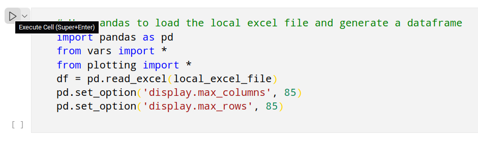

# Application Summary

Used to generate a summary for the Kubernetes sig-release shadow applicants.

The project is structured in two parts:
1. Generic plots / charts to provide some information about the applicants, without sharing any sensitive data
2. Application summary to improve how to read the applications. With applicant sensitive information which should not get shared publicly.

<mark>ITS ONLY POSSIBLE TO USE THIS PROJECT IF YOU HAVE ACCESS TO THE APPLICANT.XLSX FILE</mark>

## Getting started

To start using the project and generate applicant plots & applicant text follow the steps one by one
1. Install python3 & check your version with `python3 --version`
2. Clone the repository
3. Move the `Kubernetes Release Team Shadow Application.xlsx` file to the project root.
4. Start the jupyter notebook server (recommended to use the [vscode plugin](https://code.visualstudio.com/docs/datascience/jupyter-notebooks))
5. Open the file `main.ipynb` and update the variables `release_version` & `local_excel_file` (check your excle file if the schema changes, update the `schema variables` too)
6. Execute the jupyter cells 

7. Plot images are getting stored to the folder `plots` & Applicant texts are getting stored to the folder `applicants`

<mark>Make sure not to push the jupyter notebook with previewed data to github or somewhere as it still contains the information</mark>

