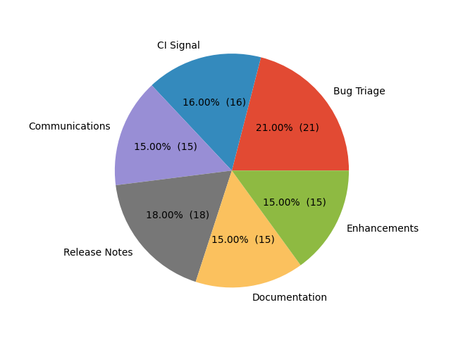
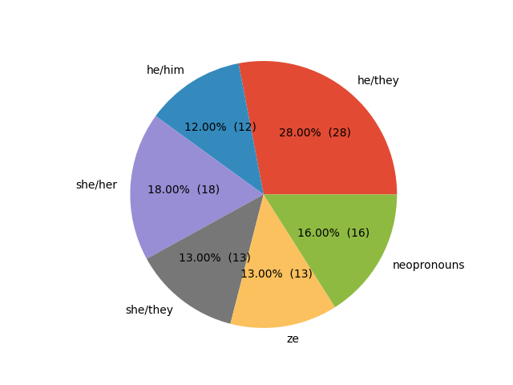

# Release Team Shadow Applicant analysis

This project is being developed in the scope of Kubernetes [sig-release](https://github.com/kubernetes/sig-release/blob/master/release-team/README.md). The project intent 
is to initiate a discussion aimed at improving the Release Team Shadow program. This project could also be the subject of a donation to one of the Kubernetes repos/orgs.

## Summary
This project is designed to support at the release team shadow selection process. It should be used in the shadow selection phase and to communicate transparently with the community about the current status of the release team shadow program.    

**Project Goals**:
* Improve the release team shadow selection process
* Provide some transparency about the current shadow program

## Current Situation
Currently, there is nothing really in place. 
* Since the applicant data is confidential. The information is not shared. No one outside of sig-release has any idea of the status of the shadow application program.

* The release team has some guidelines, but no tools to assist in the selection of shadow applicants. This process is quite cumbersome as everything is based on Excel spreadsheets and it is difficult to review all applicants.
## Examples

Examples for the plots and the applicant summary markdown files can be found under the folder `examples/`

Release Team shadow applicants by team

Pronouns Example

...more charts can be found under `examples/plots`

By running `python main.py --test=1` dummy applicant data is getting generated.

## How to work on this project

Create local virtual environment `python3 -m venv tutorial-env` and activate the virtual environment with `source venv/bin/activate`.
Install all dependencies with `pip install -r requirements.txt`. To update the requirements run `pip freeze > requirements.txt`. 
To generate the plots and applicant summaries run `python main.py --file=your-file.xlsx`.
Make sure to place a matching xlsx file to the root dir of the project.

## Community, discussion, contribution, and support
You can reach the maintainers of this project at:

* [Kubernetes Slack](https://slack.k8s.io/) at `#sig-release` and `#release-ci-signal`

## Sponsoring SIG's
* [`sig-release`](https://github.com/kubernetes/sig-release)

## Code of conduct
Participation in the Kubernetes community is governed by the Kubernetes [Code of Conduct](code-of-conduct.md).