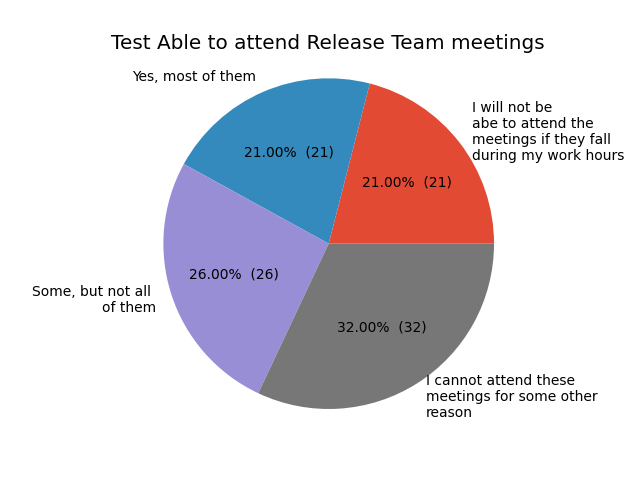

# Examples generated with Fake Data

The example files in the folder `applicants` & `plots` have been generated with fake data

**Terminology**
* Returners: Applicants that have been part of the release team before and apply again.
* Newcomers: Applicants that have not been part of the release team yet and may have applied before. 

1. [(PRIVATE) Examples of the applicant data extraction (data is not shared with the community)](#examples-markdown-extracts)
2. [(PUBLIC) Examples of the Plots (data is shared with the community)](#examples-plots--charts)


## Examples: Markdown extracts


All the files can be found under [examples/applicants](https://github.com/kubernetes-sigs/release-team-shadow-stats/tree/main/examples/applicants)

For each team a `newcomers` and a `returners` file is getting generated.

```
├── Bug Triage-newcomers.md
├── Bug Triage-returners.md
│
├── CI Signal-newcomers.md
├── CI Signal-returners.md
...
```

### Short extract (see [Bug Triage-newcomers.md](https://github.com/kubernetes-sigs/release-team-shadow-stats/blob/main/examples/applicants/Bug%20Triage-newcomers.md#n1-michael-phillips-for-bug-triage))

As mentioned before these files if generated with real applicant data is not shared publicly since it contains personal data!

```
## N1 Michael Phillips for Bug Triage

**Email**: 334-52-0005@example.com, **Name**: Michael Phillips, **Pronoun**: neopronouns, **Slack handle**: 888-91-4223, **Github handle**: 472-26-0558, **Affiliation**: UnitedHealth Group
* **Interested roles**: Bug Triage 
* **Read role handbook**: No 
* **Why interested**: Leave himself reality develop exactly. 
* **Feedback handbook**: Door dream safe wide. 
* **Timeestimate commit to releaseteam**: Billion teach more require degree trouble. 
* **Able to attend release team meetings**: No 
* **Able to attend burndown meetings**: Yes 
* **Scheduled conflicts**: Consider short letter guess half case. 
* **Volunteer for upcoming cycles**: No 
* **Timezone**: +4 
* **Experience contributing**: They lose similar movement speak pay. 
* **Signed cla**: No 
* **K8s org member**: Yes 
* **Prior release teams**: Century increase almost subject. 
* **Relevant experience**: Improve personal world. Factor close whether ground now decision. Matter live these cell sell generation we. Small make smile decide wish say. 
* **Goals**: Daughter nothing wear reality there. Your help agree trouble newspaper some turn. 
* **Contribution plans**: But father how different tough. Source attention general subject. Avoid imagine little piece need. 
* **Comments**: High case other they material go actually. 
* **Applied previously**: No 
```

## Examples: Plots / Charts

#### Interested in teams


#### Company / Affiliation


#### How often applied to the release team


#### Timezone


#### Previously served in the release team


#### Previous roles as a returner to the release team


#### Attend Burndown meetings


#### Attend Release Team meetings
