# Examples generated with Fake Data

The example files in the folder `applicants` & `plots` have been generated with fake data

**Terminology**
* Returners: Applicants that have been part of the release team before and apply again.
* Newcomers: Applicants that have not been part of the release team yet and may have applied before. 

1. [(PRIVATE) Examples of the applicant data extraction (data is not shared with the community)](#examples-markdown-extracts)
2. [(PUBLIC) Examples of the Plots (data is shared with the community)](#examples-plots--charts)

The plots are getting shared in a report with the community at the beginning of a release cycle. The [report template can be found under the `reports` folder](https://github.com/kubernetes-sigs/release-team-shadow-stats/tree/main/examples/reports/report-template.md).

## Examples: Markdown extracts

All the files can be found under [examples/applicants](https://github.com/kubernetes-sigs/release-team-shadow-stats/tree/main/examples/applicants)

For each team a `newcomers` and a `returners` file is getting generated.

```
├── Bug Triage-newcomers.md
├── Bug Triage-returners.md
│
├── CI Signal-newcomers.md
├── CI Signal-returners.md
...
```

### Short extract (see [Bug Triage-newcomers.md](https://github.com/kubernetes-sigs/release-team-shadow-stats/blob/main/examples/applicants/Bug%20Triage-newcomers.md#n1-michael-phillips-for-bug-triage))

As mentioned before these files if generated with real applicant data is not shared publicly since it contains personal data!

```
## N1 Michael Phillips for Bug Triage

**Email**: 334-52-0005@example.com, **Name**: Michael Phillips, **Pronoun**: neopronouns, **Slack handle**: 888-91-4223, **Github handle**: 472-26-0558, **Affiliation**: UnitedHealth Group
* **Interested roles**: Bug Triage 
* **Read role handbook**: No 
* **Why interested**: Leave himself reality develop exactly. 
* **Feedback handbook**: Door dream safe wide. 
* **Timeestimate commit to releaseteam**: Billion teach more require degree trouble. 
* **Able to attend release team meetings**: No 
* **Able to attend burndown meetings**: Yes 
* **Scheduled conflicts**: Consider short letter guess half case. 
* **Volunteer for upcoming cycles**: No 
* **Timezone**: +4 
* **Experience contributing**: They lose similar movement speak pay. 
* **Signed cla**: No 
* **K8s org member**: Yes 
* **Prior release teams**: Century increase almost subject. 
* **Relevant experience**: Improve personal world. Factor close whether ground now decision. Matter live these cell sell generation we. Small make smile decide wish say. 
* **Goals**: Daughter nothing wear reality there. Your help agree trouble newspaper some turn. 
* **Contribution plans**: But father how different tough. Source attention general subject. Avoid imagine little piece need. 
* **Comments**: High case other they material go actually. 
* **Applied previously**: No 
```

## Examples: Plots / Charts

#### Interested in teams
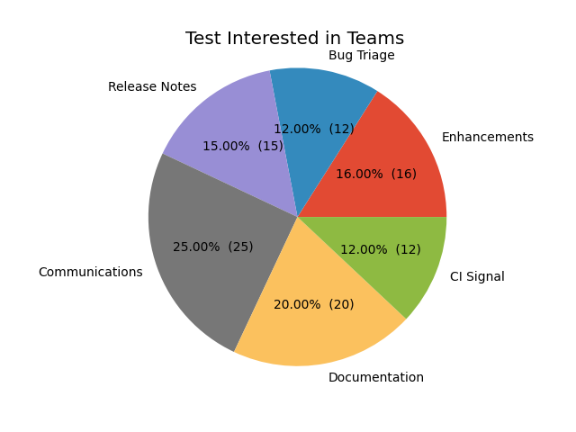

#### Company / Affiliation
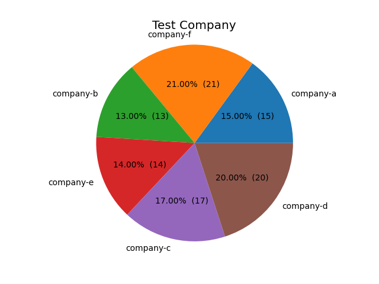

#### How often applied to the release team
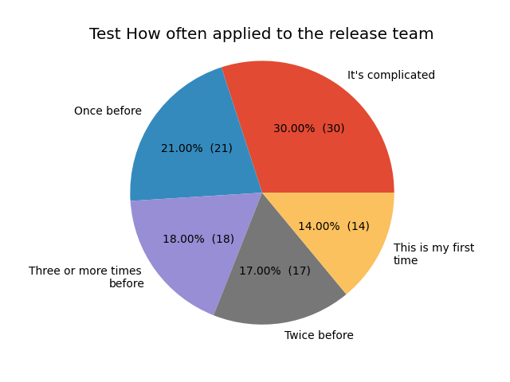

#### Timezone
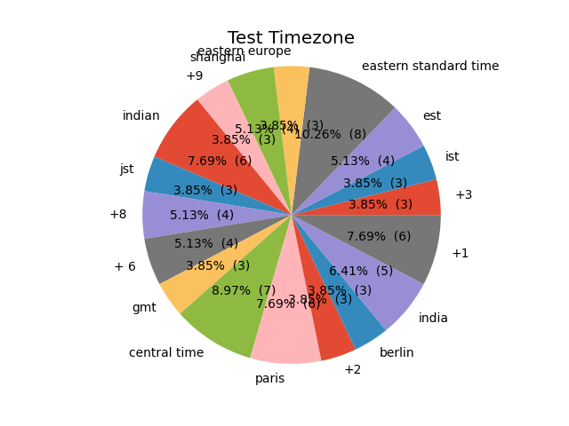

#### Previously served in the release team
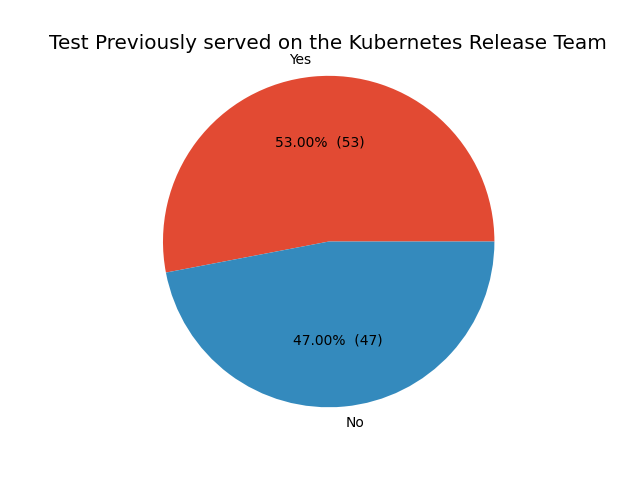

#### Previous roles as a returner to the release team
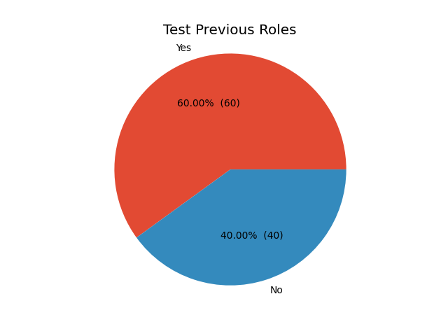

#### Attend Burndown meetings
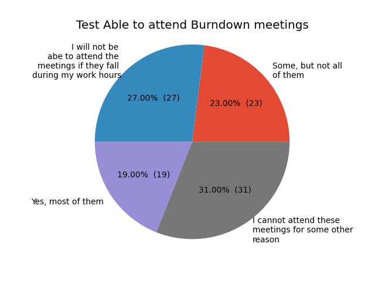


### Plots: By team

Plots are getting generated for each team in the release team that you can apply via the release team shadow application form.  

1. [Bug Triage](#bug-triage)
2. [CI Signal](#ci-signal)
3. [Communications](#communications)
4. [Documentation](#documentation)
5. [Release Notes](#release-notes)

Each team has the same types of plots.
- Timezone
- Returners / Newcomers
- Pronouns

#### Bug Triage

1. [Bug Triage: Timezone](#bug-triage-timezone)
2. [Bug Triage: Returners / Newcomers](#bug-triage-returners-newcomers)
3. [Bug Triage: Pronouns](#bug-triage-pronouns)

##### Bug Triage Timezone
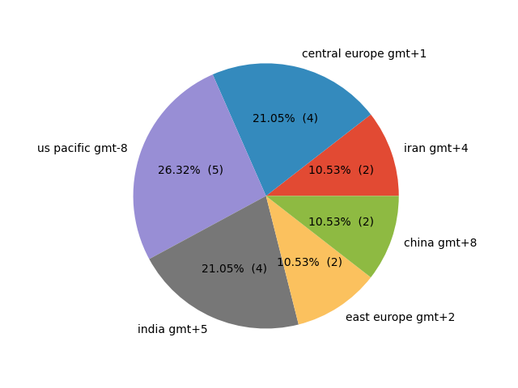

##### Bug Triage Returners, Newcomers
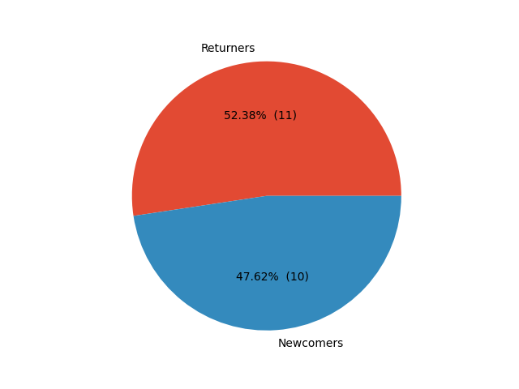

##### Bug Triage Pronouns


#### CI Signal

1. [CI Signal: Timezone](#ci-signal-timezone)
2. [CI Signal: Returners / Newcomers](#ci-signal-returners-newcomers)
3. [CI Signal: Pronouns](#ci-signal-pronouns)

##### CI Signal Timezone
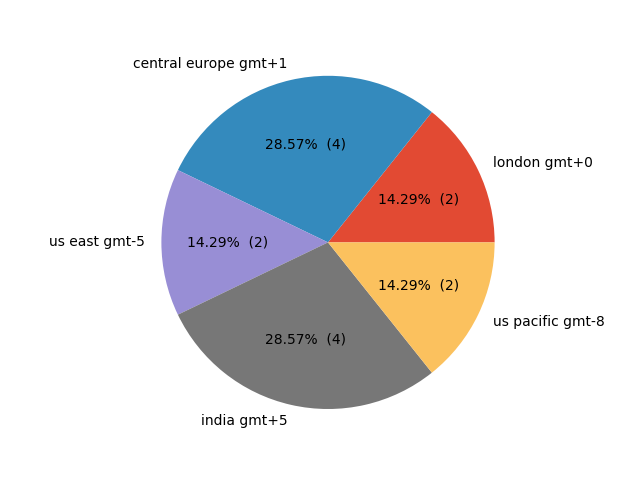

##### CI Signal Returners, Newcomers
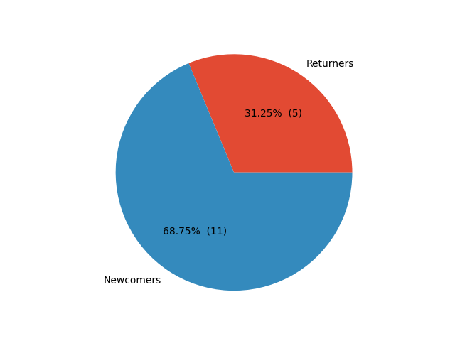

##### CI Signal Pronouns
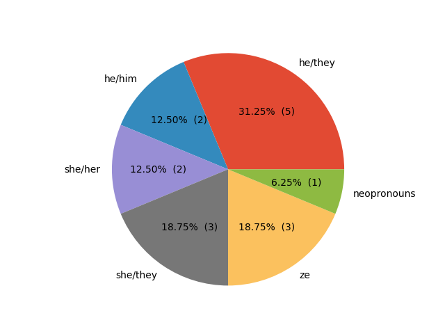

#### Communications

1. [Communications: Timezone](#communications-timezone)
2. [Communications: Returners / Newcomers](#communications-returners-newcomers)
3. [Communications: Pronouns](#communications-pronouns)

##### Communications Timezone
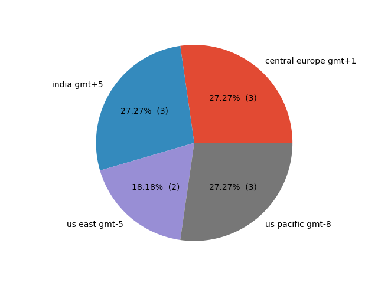

##### Communications Returners, Newcomers


##### Communications Pronouns
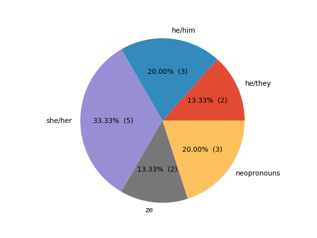

#### Documentation

1. [Documentation: Timezone](#documentation-timezone)
2. [Documentation: Returners / Newcomers](#documentation-returners-newcomers)
3. [Documentation: Pronouns](#documentation-pronouns)

##### Documentation Timezone
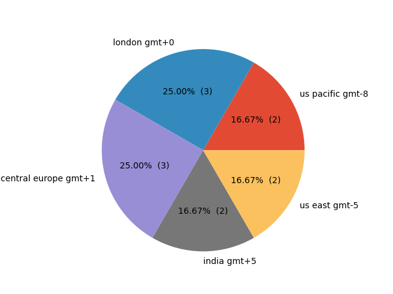

##### Documentation Returners, Newcomers
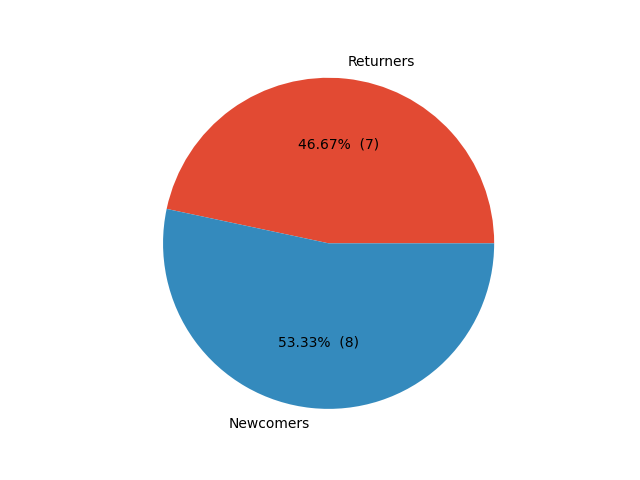

##### Documentation Pronouns
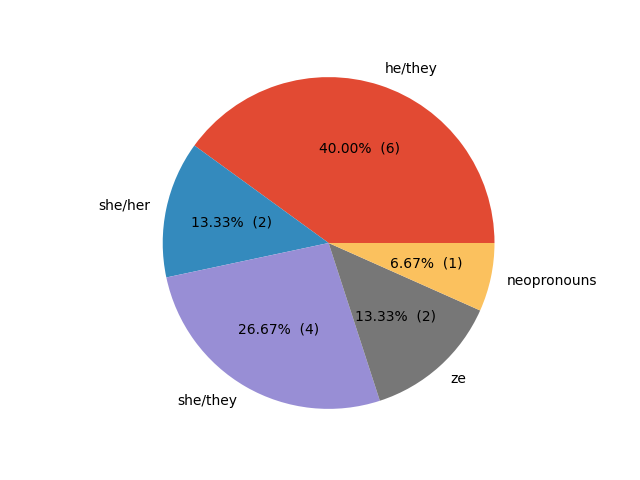

#### Release Notes

1. [Release Notes: Timezone](#release-notes-timezone)
2. [Release Notes: Returners / Newcomers](#release-notes-returners-newcomers)
3. [Release Notes: Pronouns](#release-notes-pronouns)

##### Release Notes Timezone
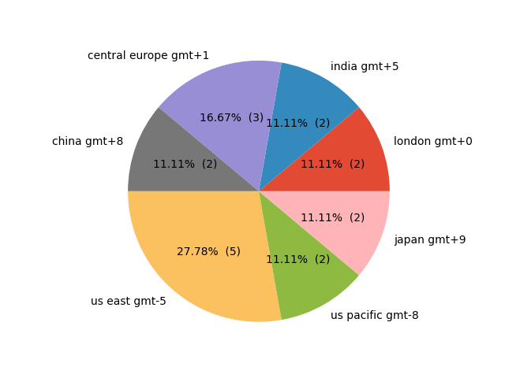

##### Release Notes Returners, Newcomers
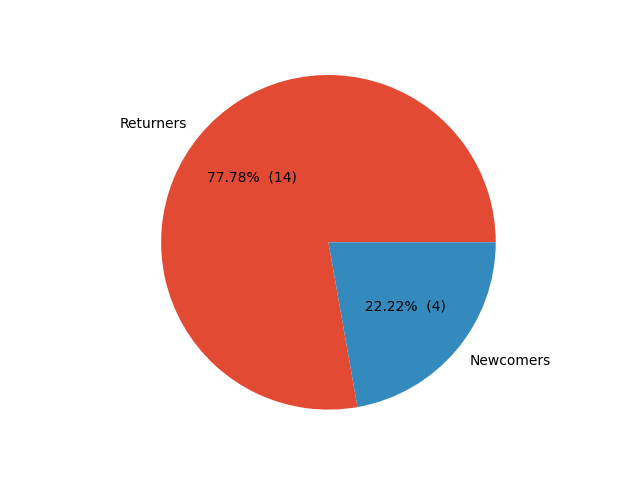

##### Release Notes Pronouns
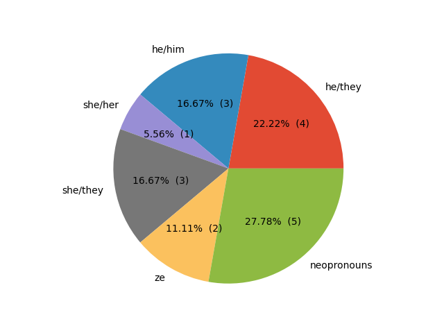