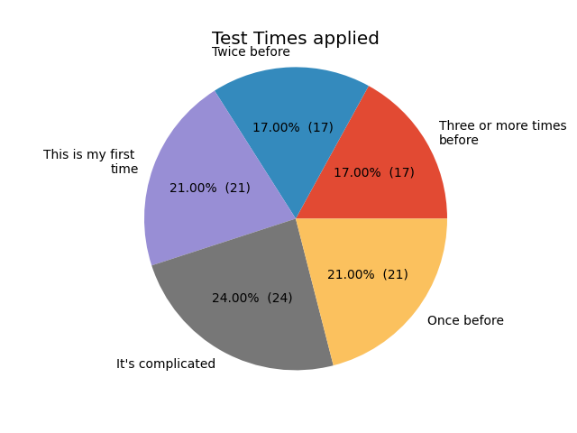

# Kubernetes Release Team Shadow Application Report for the release cycle 1.XX

Hello and welcome to the release-team-shadow-stats report for the Kubernetes release cycle 1.XX. This document reports the current status about the release team shadow application program which is open to apply for before a Kubernetes release cycle starts, you can read [here](https://github.com/kubernetes/sig-release/tree/master/release-team) more about the release team shadow application program.

<table>
<tr><td> 

##### Applicants by team

_add a comparison to previous cycle_
</td><td>

##### Company Affiliation

_add a comparison to previous cycle_
</td></tr><tr><td> 

##### Reapplying Applicants (Newcomer & Returner)

_add a comparison to previous cycle_
</td><td>

##### Returners, Newcomers ratio

_add a comparison to previous cycle_
</td></tr><tr><td> 

##### Timezone

_add a comparison to previous cycle_
</td><td>

##### Previous Release Team Roles (Returners)

_add a comparison to previous cycle_
</td></tr><tr><td> 

##### Able to attend Release Team meetings

_add a comparison to previous cycle_
</td><td>

##### Able to attend Burndown meetings

_add a comparison to previous cycle_
</td></tr><tr>
</table>

---

If you like to leave feedback feel free to reach out to `#sig-release` or `#contribEx` on Slack or just open up an issue in the [release-team-shadow-stats](https://github.com/kubernetes-sigs/release-team-shadow-stats) repo and tag one of the [owners](https://github.com/kubernetes-sigs/release-team-shadow-stats/blob/main/OWNERS), Thanks!
