# Kubernetes Release Team Shadow Application Report for the release cycle 1.XX

<!-- 

    INTRODUCTION

-->
## Introduction

Hello and welcome to the release-team-shadow-stats report for the release cycle 1.XX. This document should report the current status about the release team shadow application program which is open to apply for before a Kubernetes release cycle starts, you can read here more about the release team shadow application program.

The charts are structured in two sections, the general charts with all applicants in scope and more specific charts for each team. 

- [General charts](#general-charts)
- [Team charts](#charts-by-team)

If you have any questions or suggestions to improve this report feel free to reach out to `#sig-release` / `#contribEx` on Slack or just open up an issue in the [release-team-shadow-stats](https://github.com/kubernetes-sigs/release-team-shadow-stats) repo and tag one of the [owners](https://github.com/kubernetes-sigs/release-team-shadow-stats/blob/main/OWNERS) :). Thanks!

<!-- 

    GENERAL CHARTS

-->
## General charts

<table>
<tr>
<td> 

### Applicants by team
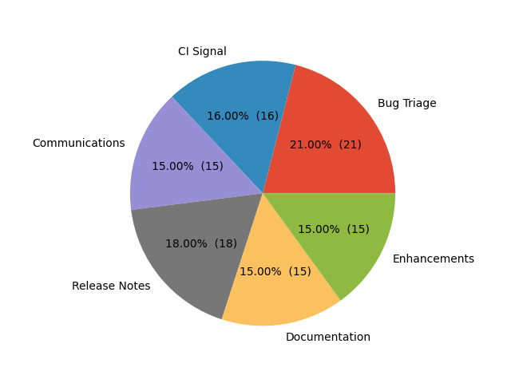
_comparison to previous cycle_
</td>
</tr>
</table>

<table>
<tr><td> 

### Company affiliation
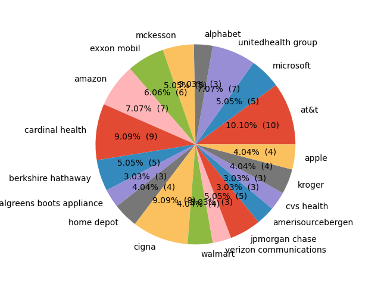
_comparison to previous cycle_
</td><td>

### Timezone

_comparison to previous cycle_
</td></tr><tr><td> 

### Affiliation

</td><td>

### Reapplying Newcomers
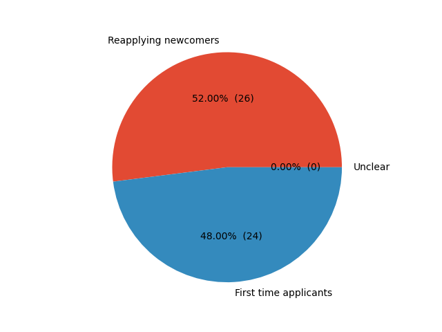
_comparison to previous cycle_
</td></tr><tr><td> 

### Pronouns
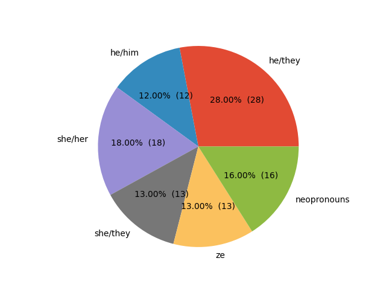
_comparison to previous cycle_
</td><td>

### Returners, Newcomers
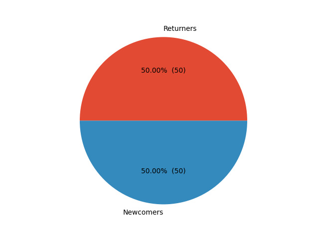
_comparison to previous cycle_
</td></tr>
</table>

<!-- 

    CHARTS BY TEAM

-->
## Charts by team

### Bug Triage

> The bug triage team is responsible to make sure that Issues and Pull Requests (PRs) which are targeted for the ongoing release cycle are dealt with in a timely fashion.

except from the [role handbook](https://github.com/kubernetes/sig-release/tree/master/release-team/role-handbooks/bug-triage)

<table>
<td> 

#### Bug Triage Timezone
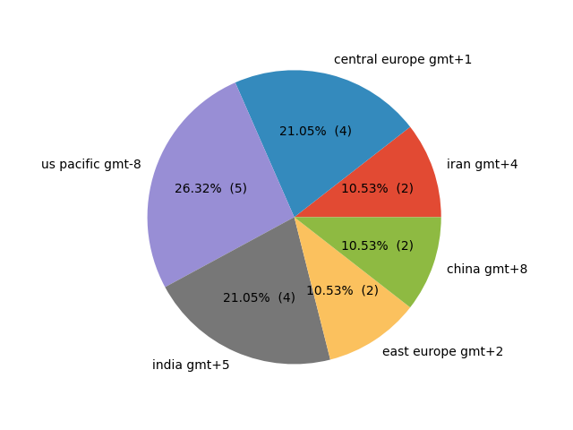
_comparison to previous cycle_
</td><td> 

#### Bug Triage Returners, Newcomers
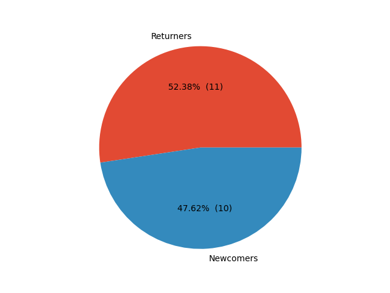
_comparison to previous cycle_
</td><td> 

#### Bug Triage Pronouns
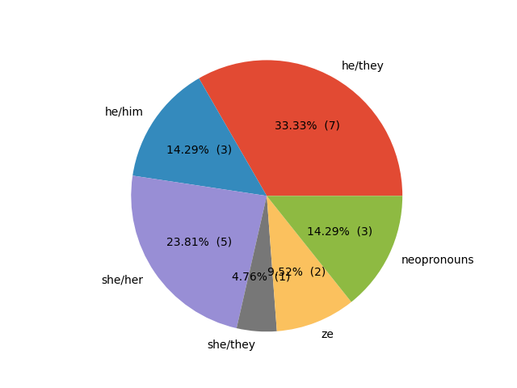
_comparison to previous cycle_
</td>
</table>

<!-- 
    CI SIGNAL
-->
### CI Signal

> The CI Signal [role responsibility] is to foster a culture of continuous test integration, fail-fast and fix-fast mindset and strive for continuously passing tests that provide true positive signal to the release team. To ensure that releases go out on-time with high quality it is absolutely critical to maintain a sustained focus on test health through the entire release cycle, as opposed to accepting destabilizing test failures during active enhancement development followed by a long test stabilization phase.

except from the [role handbook](https://github.com/kubernetes/sig-release/tree/master/release-team/role-handbooks/ci-signal)

<table>
<td> 

#### CI Signal Timezone
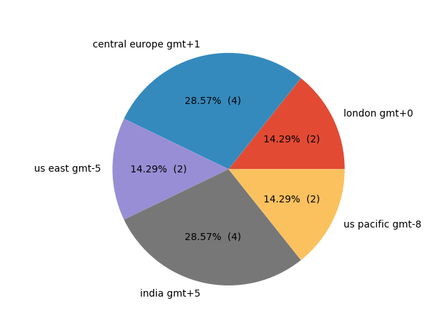
_comparison to previous cycle_
</td><td> 

#### CI Signal Returners, Newcomers
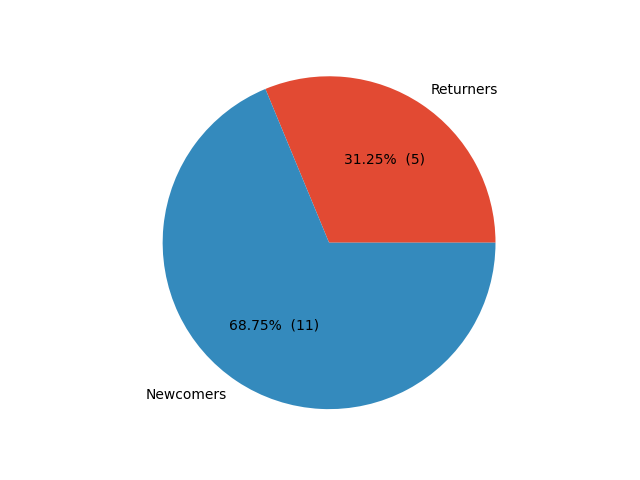
_comparison to previous cycle_
</td><td> 

#### CI Signal Pronouns
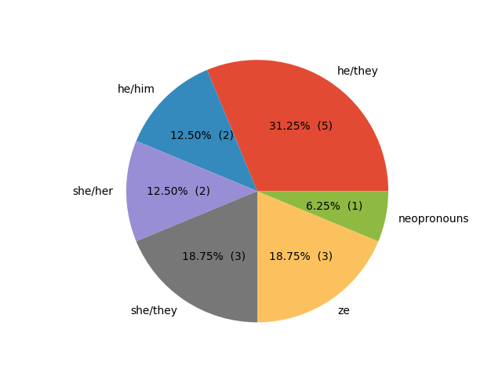
_comparison to previous cycle_
</td>
</table>

<!-- 
    COMMUNICATIONS
-->
### Communications

> The Communications role is responsible for facilitating, empowering, and curating communication between the release team and various stakeholders including the Cloud Native Computing Foundation (CNCF), the media, contributing vendors, Kubernetes project managers, and the overall Kubernetes community at large.

except from the [role handbook](https://github.com/kubernetes/sig-release/tree/master/release-team/role-handbooks/communications)

<table>
<td> 

#### Communications Timezone
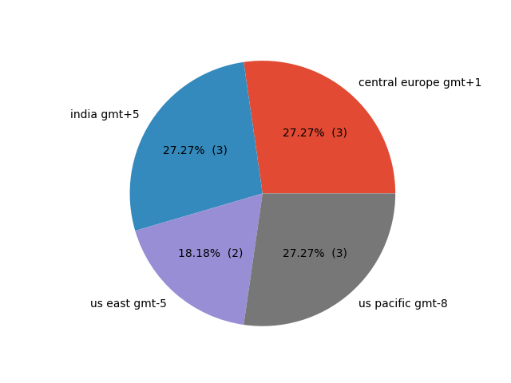
_comparison to previous cycle_
</td><td> 

#### Communications Returners, Newcomers

_comparison to previous cycle_
</td><td> 

#### Communications Pronouns
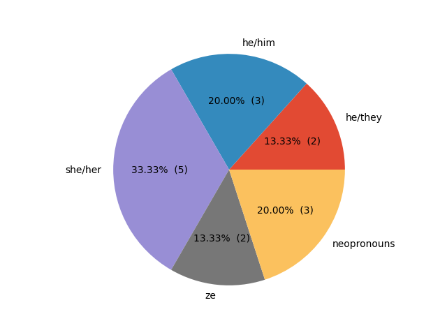
_comparison to previous cycle_
</td>
</table>

<!-- 
    DOCUMENTATION
-->
### Documentation

> The Docs [role] is responsible for working with the Release Team to coordinate documentation updates for the next Kubernetes release. [Which include a number of tasks like]: identifying and tracking new Kubernetes features and feature updates that require new content as well as offering guidance to code contributors about where new feature and enhancements documentation should live among other things

except from the [role handbook](https://github.com/kubernetes/sig-release/tree/master/release-team/role-handbooks/docs)

<table>
<td> 

#### Documentation Timezone
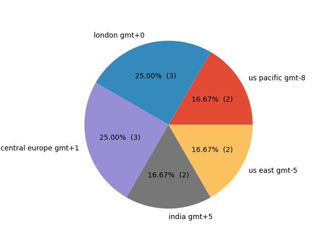
_comparison to previous cycle_
</td><td> 

#### Documentation Returners, Newcomers
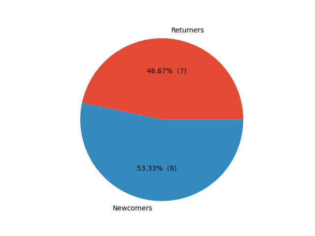
_comparison to previous cycle_
</td><td> 

#### Documentation Pronouns
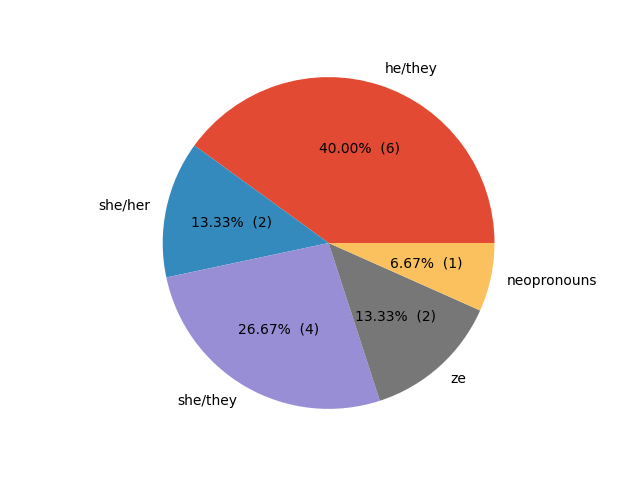
_comparison to previous cycle_
</td>
</table>

<!-- 
    ENHANCEMENT
-->
### Enhancement

> The Enhancement [role] is responsible for maintaining the active status of Enhancements within kubernetes/enhancements as well as facilitate communication between Enhancement Owners, and SIG leadership, as necessary among other things

except from the [role handbook](https://github.com/kubernetes/sig-release/tree/master/release-team/role-handbooks/enhancements)

<table>
<td> 

#### Enhancement Timezone
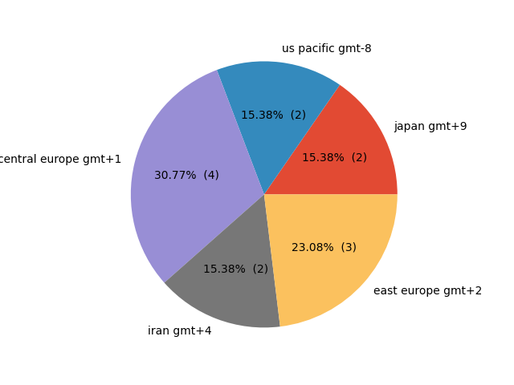
_comparison to previous cycle_
</td><td> 

#### Enhancement Returners, Newcomers

_comparison to previous cycle_
</td><td> 

#### Enhancement Pronouns
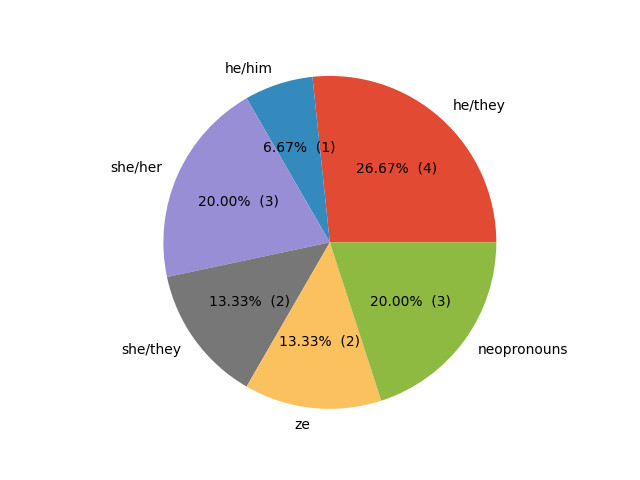
_comparison to previous cycle_
</td>
</table>

<!-- 
    RELEASE NOTES
-->
### Release Notes

> The Release Notes role is responsible for collecting and fine-tuning release-notes from the many contributions to Kubernetes between release cycles. This role is likely to find that work during the first several weeks of the release cycle is very laid back with the bulk of the tasks being completed at the end, once the release is firmed up.

except from the [role handbook](https://github.com/kubernetes/sig-release/tree/master/release-team/role-handbooks/release-notes)

<table>
<td> 

#### Release Notes Timezone
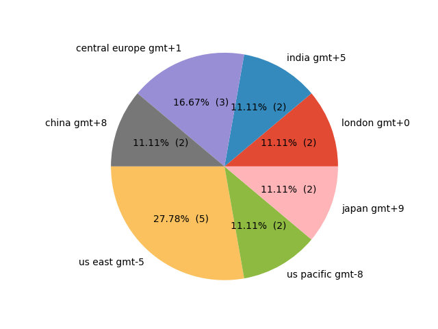
_comparison to previous cycle_
</td><td> 

#### Release Notes Returners, Newcomers
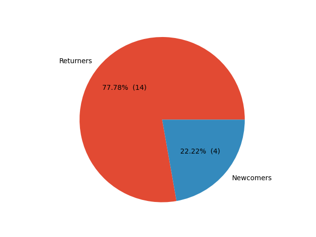
_comparison to previous cycle_
</td><td> 

#### Release Notes Pronouns
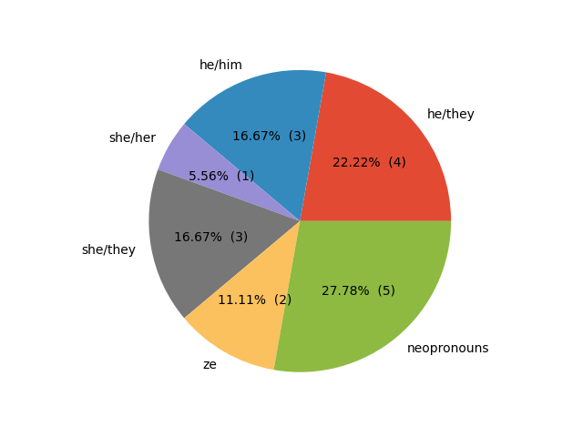
_comparison to previous cycle_
</td>
</table>

---

If you like to leave feedback feel free to reach out to `#sig-release` / `#contribEx` on Slack or just open up an issue in the [release-team-shadow-stats](https://github.com/kubernetes-sigs/release-team-shadow-stats) repo and tag one of the [owners](https://github.com/kubernetes-sigs/release-team-shadow-stats/blob/main/OWNERS) :). Thanks!
